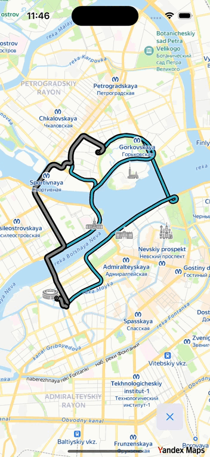

# Yandex MapKit and NaviKit Demo Apps

Yandex MapKit and NaviKit are cross-platform libraries that let you use the capabilities of Yandex Maps in mobile applications for iOS and Android. Learn more about the MapKit and NaviKit SDKs on the [documentation](https://yandex.ru/dev/mapkit/doc/en/?from=github-demo) page.

Visit the [Getting started](https://yandex.ru/dev/mapkit/doc/en/ios/generated/getting_started) page for quick start development with the MapKit SDK. 
Visit the [Getting started](https://yandex.ru/dev/mapkit/doc/en/ios/generated/navigation/getting_started) page for quick start development with the NaviKit SDK. 

The current repository contains sample code for how to use the MapKit and NaviKit SDKs for iOS applications.

## Project structures

There are three iOS projects in the repository:

1. [__`MapkitSamples`__](mapkit-samples): Contains several iOS applications with sample code in Swift, all of which are demonstrated in the MapKit SDK Tutorials documentation.

    - [`MapWithPlacemark`](mapkit-samples/MapWithPlacemark): A simple MapKit SDK application with [Getting started with MapKit for iOS](https://yandex.ru/dev/mapkit/doc/en/ios/generated/getting_started) information.

    - [`MapObjects`](mapkit-samples/MapObjects): Using the [Map Objects](https://yandex.ru/dev/mapkit/doc/en/ios/generated/tutorials/map_objects) API to add objects to the map.

    - [`MapInteraction`](mapkit-samples/MapInteraction): Examples from the [Map Interaction](https://yandex.ru/dev/mapkit/doc/en/ios/generated/tutorials/map_interaction) tutorial.

    - [`MapSearch`](mapkit-samples/MapSearch): Examples of how to use the [Search](https://yandex.ru/dev/mapkit/doc/en/ios/generated/tutorials/map_search) and [Geosuggest](https://yandex.ru/dev/mapkit/doc/en/ios/generated/tutorials/map_suggest) functionality.

    - [`MapRouting`](mapkit-samples/MapRouting): About the [Routes](https://yandex.ru/dev/mapkit/doc/en/ios/generated/tutorials/map_routes) and [Routing](https://yandex.ru/dev/mapkit/doc/en/ios/generated/tutorials/map_routing) API.

2. [__`MapKitDemo`__](mapkit-demo): A demo application that contains the basic functionality of the lite and full MapKit SDK versions. It is not supported with Tutorials documentation, unlike the `MapkitSamples` project.

3. [__`NaviKitDemo`__](navikit-ios-demo): A demo application showcasing the basic navigation features you can implement with NaviKit SDK.

## Build locally

1. Clone the repository:
    ```sh
    git clone https://github.com/yandex/mapkit-ios-demo.git
    ```

2. Execute the following command in your project's directory to install dependencies:
    ```sh
    pod install
    ```

3. MapKit SDK demo application and samples require __API key__. You can get a free MapKit __API key__ in the [Get the MapKit API Key](https://yandex.ru/dev/mapkit/doc/en/ios/generated/getting_started#key) documentation. To obtain an API key for the NaviKit SDK demo application, please contact us at [paid-api-maps@yandex-team.ru](mailto:paid-api-maps@yandex-team.ru). 

4. Depending on the project you want to build, follow the steps in the following sections.

### MapkitSamples

1. Open the __project's__ build settings. Add the following user-defined setting with your __API key__ value in place of the `YOUR_API_KEY` placeholder:

    ```pbxproj
    MAPKIT_API_KEY = "YOUR_API_KEY";
    ```

2. Choose the desired target in Xcode, build and run.

### MapKitDemo

1. Open the [`AppDelegate.swift`](mapkit-demo/MapKitDemo/AppDelegate.swift) and edit the `MAPKIT_API_KEY` constant declaration, setting its value with your __API key__ in place of the `YOUR_API_KEY` placeholder:

    ```swift
    let MAPKIT_API_KEY = "YOUR_API_KEY"
    ```

    You can as well store this __API key__ in your project's build settings and `Info.plist` file.

2. Build and run the MapKitDemo target in Xcode.

### NaviKitDemo

1. Open the project's build settings and edit the `MAPKIT_API_KEY` parameter, setting its value with your __API key__ in place of the `YOUR_MAPKIT_API_KEY` placeholder:

    ```MAPKIT_API_KEY = YOUR_MAPKIT_API_KEY;```

    You can as well store this __API key__ in your `Info.plist` file.

2. Build and run the NaviKitDemo target in Xcode.

## Support

If you have problems or suggestions while using MapKit or NaviKit, visit the [contact](https://yandex.ru/dev/mapkit/doc/en/feedback/) page.

## Sample overview

| [MapWithPlacemark](mapkit-samples/MapWithPlacemark) <br>Demonstrates how to create a MapKit map, move<br>it, and display custom tappable placemarks. | [MapObjects](mapkit-samples/MapObjects) <br>How to display different objects on the map, including:<br>images, geometries, and clusterized collections. |
|:-|:-|
|  |  |

| [MapInteraction](mapkit-samples/MapInteraction)<br> About interacting with the MapKit map using <br>camera movements, tap actions, focus rect <br> and focus point, and interactions with POIs. | [MapSearch](mapkit-samples/MapSearch) <br>Shows how to use Search and Geosuggest <br>functionality in the full MapKit SDK. |
|:-|:-|
|  |  |

| [MapRouting](mapkit-samples/map-routing)<br> Building routes using requested map points. |
|:-|
|  |
